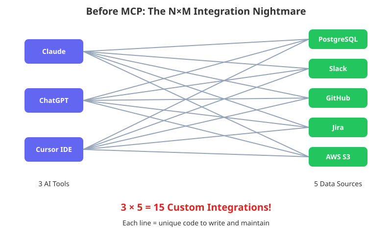
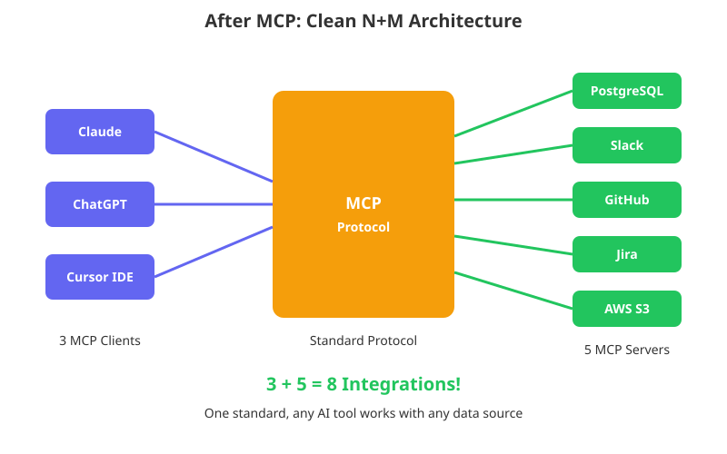
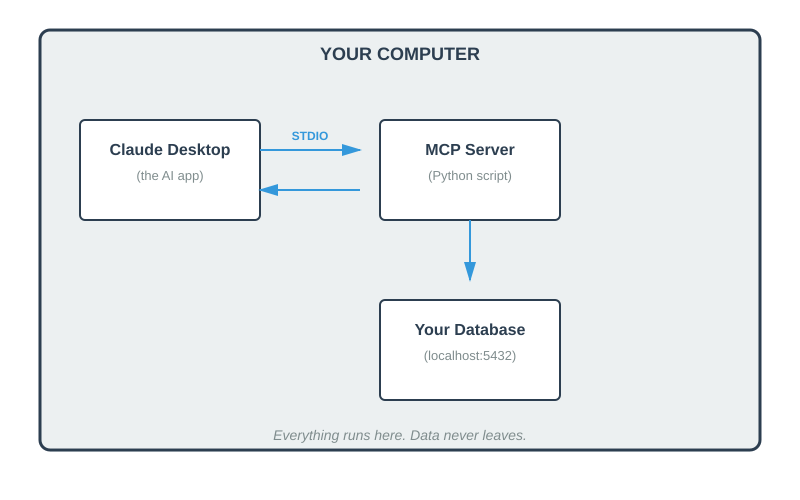

# What the Hell is MCP?
## The Problem It Solves (And Why You Should Care)

Ever tried to get Claude to query your local SQLite database? Or asked ChatGPT to read your server logs? You end up **copy-pasting data manually**.

---

## Introduction

You're debugging a production issue. You ask Claude for help. It gives you great advice, but then asks you to "copy the relevant logs and paste them here."

So you SSH into the server. Run `tail -f`. Copy 500 lines. Paste. Wait for the response. Claude asks for more context. You go back. Copy more. Paste again. **This workflow is broken!**

AI tools are brilliant at analysis, but they're blind. They can't see your files, your databases, your logs, tickets, commits. Every useful interaction becomes a tedious copy-paste dance.

**Model Context Protocol (MCP)** fixes this. By the end of this article, you'll understand what it is, why it matters, and how it works.

---

## The Problem & The Solution

### The N×M Integration Nightmare

You're a developer. Your team uses:
- **3 AI tools** (Claude, ChatGPT, Cursor)
- **5 data sources** (PostgreSQL, Slack, GitHub, Jira, local files)

To connect everything:

```
3 AI tools × 5 data sources = 15 custom integrations
```

Each integration has its own:
- plugin system
- auth scheme
- API quirks
- maintenance burden

Add one more AI tool? Now you need 5 more integrations.
Add one more data source? Now you need 3 more integrations.

**This doesn't scale.**



*Each host needs a custom connector for each data source.*

### What MCP Does

MCP introduces a single, standardized protocol boundary between AI hosts and external systems.

Instead of building custom connectors everywhere:
- Each AI host implements an MCP client once
- Each tool or data provider implements an MCP server once
- Any MCP-compatible host can talk to any MCP server

The integration effort becomes: **N + M** instead of **N×M**.

> MCP does not add intelligence. It does not replace your systems. It standardizes how AI systems access context and actions.



*One protocol. Any host talks to any server.*

---

## Under the Hood

You've got the concept. Now let's see what's actually happening.

### The Architecture

MCP has three components:

| Component | What it is | Example |
|-----------|------------|---------|
| **Host** | The UI you interact with | Claude Desktop, Cursor IDE |
| **Client** | The invisible engine inside the Host that speaks MCP | Built into Claude Desktop |
| **Server** | The bridge to your data | A Python script you write |

You talk to the Host. The Host uses its internal Client to talk to Servers. Servers talk to your actual data (database, files, APIs).

#### How They Connect

```
┌─────────────────────────────────────────────────────────────┐
│  USER                                                       │
│    ↓ asks question                                          │
│  HOST (Claude Desktop, Cursor)                              │
│    ↓ routes request                                         │
│  CLIENT (protocol adapter, built into host)                 │
│    ↓ JSON-RPC over stdio/HTTP                               │
│  SERVER (capability provider, your code)                    │
│    ↓ executes action                                        │
│  DATA SOURCE (database, files, APIs)                        │
└─────────────────────────────────────────────────────────────┘
```

The **Host** is your UI. The **Client** is the protocol adapter embedded in the host—it translates requests into MCP format. The **Server** is the capability provider you write—it exposes tools, resources, and prompts to any connected client.

### The Protocol

MCP uses **JSON-RPC 2.0** over two possible transports:
- **stdio**: The host spawns the MCP server as a subprocess. Communication happens via stdin/stdout. Common for local tooling and developer workflows.
- **Streamable HTTP**: The MCP server runs as an HTTP service. Supports streaming responses (optionally via SSE). Suitable for remote or multi-client deployments. Authentication is handled using standard HTTP mechanisms (e.g., OAuth or API keys), depending on the deployment.

A typical request looks like:

```json
{
  "jsonrpc": "2.0",
  "id": 1,
  "method": "tools/call",
  "params": {
    "name": "run_sql",
    "arguments": {
      "query": "SELECT COUNT(*) FROM users WHERE created_at > '2025-01-01'"
    }
  }
}
```

Server executes the query, returns:

```json
{
  "jsonrpc": "2.0",
  "id": 1,
  "result": {
    "content": [
      {"type": "text", "text": "1547"}
    ]
  }
}
```

*(Why a list? MCP responses can contain multiple content types ex. text, images, binary data, for rich multimodal output.)*

That's it. Request → Execute → Response. The host attaches the result as context; the model can now reason on it.

### Discovery Happens First

Before calling tools, the host:
1. Initializes the connection
2. Discovers available tools, resources, and prompts
3. Decides what to expose to the model

This allows MCP servers to be plugged in without hardcoded knowledge in the host.

### The Localhost Advantage

Here's what most people miss: **MCP servers typically run locally.**

Don't let the word "server" confuse you. In many common setups (especially stdio), the MCP server is just a script (Python, TypeScript, or any language) running as a subprocess on YOUR computer. While MCP *can* connect to remote servers via Streamable HTTP transport, local mode offers key advantages:



The MCP Server is YOUR code, running with YOUR permissions, accessing YOUR local files and databases. The host's MCP client sends a JSON request to this local process, the process queries your data and returns the result.

**Key privacy properties of local MCP servers:**
- No third-party integration service required
- No API keys to external services for the MCP layer itself
- The server runs locally and accesses local data

This is valuable for:
- Reading local log files
- Querying local databases
- Accessing code on your machine
- Working with sensitive company data

> **Important:** A local MCP server does not imply a local model. If your host uses a cloud LLM, any tool output included in the conversation will be sent to that model provider. MCP standardizes access—it does not define the privacy boundary. Whether data leaves your machine depends on your host and model configuration.

---

## The Three Primitives

MCP servers expose three types of capabilities:

### 1. Tools
**Actions the AI can execute.**

```
┌─────────────────────────────────────────────────┐
│ TOOLS = Functions with side effects             │
├─────────────────────────────────────────────────┤
│ • run_sql(query) → Execute SQL, return results  │
│ • send_slack(channel, msg) → Post message       │
│ • restart_pod(name) → Restart K8s pod           │
│ • write_file(path, content) → Create/update     │
└─────────────────────────────────────────────────┘
```

The AI decides when to call a tool based on the conversation.

**Example tool call:**
```json
{"name": "run_sql", "arguments": {"query": "SELECT * FROM orders LIMIT 5"}}
```

> **Safety Note:** Hosts often prompt before executing destructive tools, but enforcement depends on host configuration. Servers should still validate inputs and restrict dangerous operations.

### 2. Resources 
**Data the AI can read.**

```
┌─────────────────────────────────────────────────┐
│ RESOURCES = Read-only data sources              │
├─────────────────────────────────────────────────┤
│ • file:///var/log/app.log → Log contents        │
│ • postgres://schema → Database structure        │
│ • git://recent-commits → Last 10 commits        │
│ • config://settings → App configuration         │
└─────────────────────────────────────────────────┘
```

Resources are URIs the application can attach to the conversation as context.

### 3. Prompts 
**Pre-built conversation templates.**

```
┌─────────────────────────────────────────────────┐
│ PROMPTS = Reusable starting points              │
├─────────────────────────────────────────────────┤
│ • "Debug System" → Pre-loads logs + metrics     │
│ • "Code Review" → Loads PR diff + guidelines    │
│ • "Weekly Report" → Aggregates from 3 sources   │
└─────────────────────────────────────────────────┘
```

Prompts bundle context together. User selects a prompt, it expands into a message with data pre-attached.

---

## Real-World Examples

### Local Database Query

**Without MCP:**
```
You: How many users signed up last week?
Claude: I don't have access to your database. Please run this SQL…
You: *opens terminal, runs query, copies result, pastes back*
```

**With MCP:**
```
You: How many users signed up last week?
```
```json
→ Tool Call: {"name": "run_sql", "arguments": {"query": "SELECT COUNT(*) FROM users WHERE created_at > NOW() - INTERVAL '7 days'"}}
← Result: {"content": [{"type": "text", "text": "1547"}]}
```
```
Claude: 1,547 users signed up last week. That's up 23% from the previous week.
```

### Local File Analysis

**Without MCP:**
```
You: Why did the server crash at 3am?
Claude: Please share the relevant log entries…
You: *SSH, grep, copy 200 lines, paste, wait, repeat*
```

**With MCP:**
```
You: Why did the server crash at 3am?
```
```json
→ Tool Call: {"name": "read_logs", "arguments": {"path": "/var/log/app.log", "since": "2025-01-09T03:00:00"}}
← Result: {"content": [{"type": "text", "text": "OOM killer invoked… process killed…"}]}
```
```
Claude: The app was killed by the OOM killer at 3:14am. Memory usage 
        spiked to 98%. Looks like a memory leak in the batch job that 
        runs at 3am. Here's the relevant stack trace…
```

### Kubernetes Debugging

```
You: Why is the checkout-service pod failing?
```
```json
→ Tool Call: {"name": "get_pod_logs", "arguments": {"pod": "checkout-service-7d8f9", "namespace": "prod"}}
← Result: {"content": [{"type": "text", "text": "Connection refused: payment-gateway:443…"}]}
```
```
Claude: The checkout-service can't reach the payment gateway. The 
        payment-gateway service appears to be down. Want me to 
        check its status?
```

---

## Why This Was Built

Anthropic open-sourced MCP in November 2024 as a way to connect AI assistants to the systems where data actually lives. Rather than building thousands of proprietary integrations, they published an open spec and let the community build servers for their own tools and data sources.

MCP is:
- **Open specification** anyone can implement
- **Open source SDKs** in Python and TypeScript
- **Not proprietary** to Claude—works with any compliant AI tool

---

## Key Takeaways

- **The N×M Problem:** Custom integrations for every AI + data source combo
- **MCP Solution:** A standard protocol that turns N×M into N+M
- **How It Works:** JSON-RPC over stdio (local) or Streamable HTTP (remote)
- **Privacy:** Local servers access local data; whether output leaves your machine depends on your host/model
- **Three Primitives:**
  - Tools = Actions (run query, send message)
  - Resources = Data (files, schemas)
  - Prompts = Templates (pre-built workflows)
- **Open Standard:** Not locked to Claude—any AI tool can implement it

---

## What's Next?

You now understand what MCP is and why it exists. Next, we'll go deeper into the architecture.

In **Blog 2: MCP Architecture Deep Dive**, we'll cover:
- Host, Client, Server in detail
- stdio vs Streamable HTTP transports
- The complete lifecycle of a request
- How tool discovery works

**[Continue to Blog 2 →](../blog-2/)**

---

## Quick Reference

### MCP in One Sentence
> A JSON-RPC protocol that standardizes how AI applications connect to local data sources and tools.

### The Math

| Before MCP | After MCP |
|------------|-----------|
| N × M integrations | N + M integrations |
| 3 AI × 5 sources = 15 | 3 + 5 = 8 |

### The Three Primitives

| Primitive | Type | Example |
|-----------|------|---------|
| Tools | Actions | `run_sql()`, `send_slack()` |
| Resources | Read-only data | `file:///logs/app.log` |
| Prompts | Templates | "Debug Production Issue" |

---

*Next: [Blog 2 - MCP Architecture Deep Dive](../blog-2/) →*
