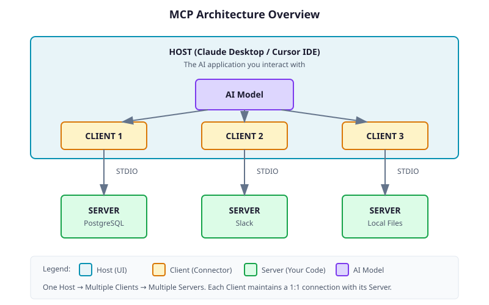
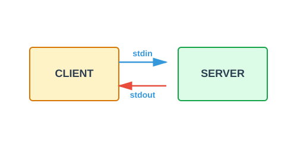
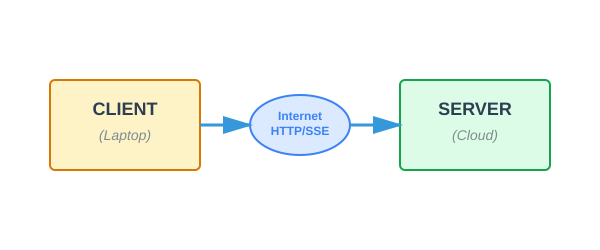
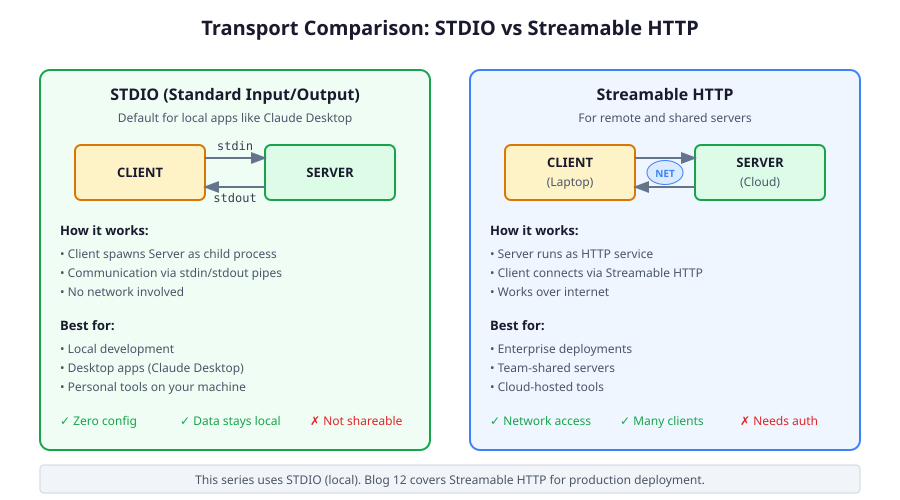
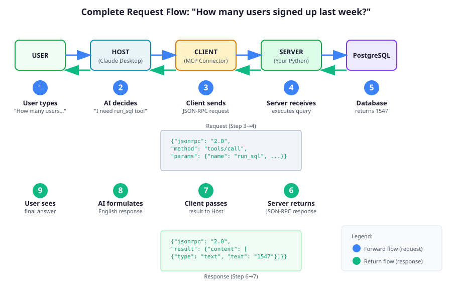
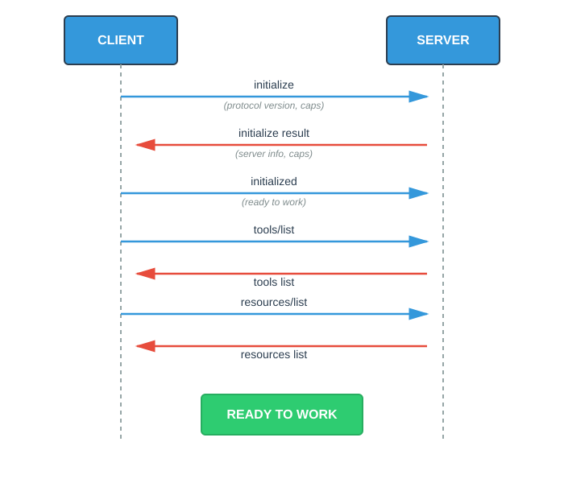

# MCP Architecture Deep Dive
## The Players, The Primitives, and The Protocol

---

> Before you write a single line of code, you need to understand the players in the MCP game and how they talk to each other.

---

## Introduction

In Blog 1, we established *why* MCP exists, to solve the N×M integration nightmare. Now we're going under the hood.

We're not writing code today. Today is about **mental models**. If you understand the architecture now, debugging will be trivial later. If you skip this, you'll be staring at "Connection Refused" in Blog 3 wondering who's refusing whom.

Three players. Three primitives. One protocol. Let's go.

---

## The Three Players

MCP isn't just "connecting to a database." It's a chain of three distinct software components, each with a specific job.

### Player 1: HOST

| | |
|---|---|
| **What** | The brain that makes decisions and formats responses |
| **Examples** | Claude Desktop, Cursor IDE, rule-based scripts, monitoring systems |
| **Role** | Decides which tools to call, formats results for the user |

The Host is the decision-maker. When you ask "How many users signed up last week?", the Host analyzes your question and decides: "I need to call the `run_sql` tool with this query."

**The Host doesn't have to use AI.** It could be:
- **AI-powered** (Claude decides which tool to use based on conversation)
- **Rule-based** (if CPU > 90%, call `restart_service`)
- **Scheduled** (every 2am, call `run_backup`)
- **Pattern-matched** (regex triggers specific tools)

The Host also does the final formatting. When it gets back "1547" from the database, the Host (if it's AI-powered) turns that into: "1,547 users signed up last week. That's up 23% from the previous week."

**In Claude Desktop:** The Host is the entire application you interact with - the chat UI, the Claude AI model that thinks, and the response formatter.

### Player 2: CLIENT

| | |
|---|---|
| **What** | The protocol messenger (invisible infrastructure code) |
| **Lives in** | Inside the Host application |
| **Role** | Wraps Host decisions in MCP protocol format, manages Server connections |

The Client is the postal service between Host and Server.

When the Host decides "Call `run_sql` with query 'SELECT COUNT(*)'", the Client's job is purely mechanical:
1. Wrap that decision in JSON-RPC format: `{"method": "tools/call", "params": {...}}`
2. Send it to the Server (via STDIO or SSE)
3. Wait for the response
4. Pass the raw result back to the Host

**The Client has zero intelligence.** It doesn't decide which tool to call. It doesn't format responses for users. It's just a messenger that knows how to speak the MCP protocol.

**In Claude Desktop:** When you configure 3 servers in your config file, Claude Desktop spawns 3 internal Clients - one per server. You never see them directly. They're background workers managing the MCP connections while the Host (Claude) does the thinking.

> **Why separate Clients if the protocol is the same?**
> 
> Good question! All Clients use identical JSON-RPC format. The reason for multiple Clients is **connection management**, not different protocols. Each Client manages:
> - A separate communication channel (different stdin/stdout pipes to different processes)
> - Request/response tracking (Client 1's request ID #5 is separate from Client 2's request ID #5)
> - Server-specific tool discovery (Client 1 knows `run_sql`, Client 2 knows `send_message`)
>
> Think of it like phone calls on your smartphone: same voice protocol, but you need separate channels to keep multiple conversations straight. One Client = one active connection to one Server.

### Player 3: SERVER

| | |
|---|---|
| **What** | A standalone program that exposes data or actions |
| **Written by** | You, or the community |
| **Role** | Does the actual work - queries databases, calls APIs, reads files |

The Server is where your code lives. It has the database credentials, the file system access, the API keys. It executes logic and returns results.

When the Server receives `{"method": "tools/call", "params": {"name": "run_sql", "arguments": {"query": "SELECT COUNT(*) FROM users..."}}}`, it:
1. Parses the JSON
2. Executes the SQL query
3. Returns the result: `{"result": {"content": [{"type": "text", "text": "1547"}]}}`

The Server doesn't care who's calling it - AI, rules, or scheduled tasks. It just executes tools when asked.

### How They Work Together

Here's the complete flow when you ask Claude a question:

```
USER: "How many users signed up last week?"
  ↓
HOST: Analyzes question → Decides to call run_sql tool
  ↓
CLIENT: Wraps decision as JSON-RPC → Sends to Server
  ↓
SERVER: Executes SQL query → Returns "1547"
  ↓
CLIENT: Passes raw result back to Host
  ↓
HOST: Formats result → "1,547 users signed up last week. That's up 23%."
  ↓
USER: Sees the natural language response
```

**Key insight:** One Host can connect to multiple Servers. Each connection is managed by a separate Client instance inside the Host. The Host sees all the tools from all Servers as one unified toolkit.



**The diagram shows:** Claude Desktop (Host) contains 3 Clients, each managing a connection to a different Server (Postgres, Slack, Files). The AI model in Claude sees all the tools from all 3 servers as if they're one integrated system.

---

## The Three Primitives

Servers don't just "do everything." They expose specific capabilities through three primitives.

### Primitive 1: TOOLS 

**Functions the Host can invoke.**

```
┌─────────────────────────────────────────────────────────┐
│ TOOLS = Invocable capabilities (read or write)          │
├─────────────────────────────────────────────────────────┤
│ • run_sql(query) → Execute SQL, return results          │
│ • send_slack(channel, msg) → Post a message             │
│ • restart_pod(name) → Restart a K8s pod                 │
│ • create_file(path, content) → Write to disk            │
└─────────────────────────────────────────────────────────┘
```

**Who controls it:** The Host (via AI model, rules, or code). The Host decides when to call a tool.

**Key characteristic:** Tools are *invoked* operations. Some are read-only (list, search, inspect). Others mutate state (create, delete, restart).

**Discovery:** When a Client connects to a Server, it calls `tools/list` to discover what tools are available. The Server returns a list with names, descriptions, and input schemas.

```json
{
  "tools": [
    {
      "name": "run_sql",
      "description": "Execute a SQL query against the database",
      "inputSchema": {
        "type": "object",
        "properties": {
          "query": {"type": "string", "description": "The SQL query to run"}
        },
        "required": ["query"]
      }
    }
  ]
}
```

**In AI-powered hosts,** the model reads these descriptions to decide when to call each tool. In rule-based hosts, these schemas validate parameters and document available capabilities.

### Primitive 2: RESOURCES 

**Data the Host (and model, if present) can read.**

```
┌─────────────────────────────────────────────────────────┐
│ RESOURCES = Read-only data sources                      │
├─────────────────────────────────────────────────────────┤
│ • file:///var/log/app.log → Log file contents           │
│ • postgres://mydb/schema → Database table structure     │
│ • git://repo/recent-commits → Last 10 commits           │
│ • config://app/settings → Application configuration     │
└─────────────────────────────────────────────────────────┘
```

**Who controls it:** The User or Host. You explicitly attach a resource (like dragging a file into context), or the Host attaches it automatically based on context.

**Key characteristic:** Read-only. Shouldn't have side effects. Reading a resource is meant to be passive observation (though servers may log access for auditing).

**Resources vs Tools:** Resources are like documents, metadata, or snapshots. If you need computed data (like query results from a live database), that's usually a Tool call, not a Resource read.

**Discovery:** Client calls `resources/list`. Server returns available resources with URIs and descriptions.

### Primitive 3: PROMPTS

**Pre-built conversation templates.**

```
┌─────────────────────────────────────────────────────────┐
│ PROMPTS = Reusable conversation starters                │
├─────────────────────────────────────────────────────────┤
│ • "Debug System" → Pre-loads logs + error patterns      │
│ • "Code Review" → Loads guidelines + PR diff            │
│ • "Weekly Report" → Aggregates from 3 data sources      │
└─────────────────────────────────────────────────────────┘
```

**Who controls it:** The User. You select a prompt from a menu to start a conversation with context pre-loaded.

**Key characteristic:** Structure. Instead of typing "check the logs for errors," a prompt packages that instruction with the actual log data attached.

**Discovery:** Client calls `prompts/list`. Server returns available prompts with names, descriptions, and optional arguments.

### Primitive 4: SAMPLING

**Server-initiated LLM requests.**

```
┌─────────────────────────────────────────────────────────┐
│ SAMPLING = Server asks Host to run LLM completions      │
├─────────────────────────────────────────────────────────┤
│ • Summarize this 50-page document I just scraped        │
│ • Review this code and suggest improvements             │
│ • Decide which of these 10 results is most relevant     │
└─────────────────────────────────────────────────────────┘
```

**Who controls it:** The Server initiates the request, but the **Host controls approval and execution**. The Host can show the user what the Server is asking for, require confirmation, or reject it entirely.

**Key characteristic:** Bidirectional intelligence. While Tools let the Host call the Server, Sampling lets the Server leverage the Host's LLM capabilities. This enables **agentic loops** where the server can process large amounts of data and ask the AI to help make sense of it.

**Why it matters:** Imagine a web scraping server that reads 50 pages. Instead of sending all that text back to the Host (overwhelming the context), the server can use Sampling to summarize each page locally, then return only the summaries. The AI helps the server, not just the other way around.

**Discovery:** Server declares `sampling` capability during initialization. Host decides whether to allow it.

> **We'll use Sampling extensively in Blog 10-11** when building a research assistant that browses the web and summarizes findings.

### Summary: Who Controls What?

**The Host is the gatekeeper.** Even if the AI model wants to call a tool, the Host can require user approval. Even if a resource exists, the Host decides whether to attach it. Even when a Server requests Sampling, the Host controls whether to execute it. The control flow is: **User ↔ Host ↔ Model** (for AI-powered hosts) or **User ↔ Host** (for rule-based hosts).

---

## Transport Layers: How They Talk

The Client needs to communicate with the Server. MCP supports two transport mechanisms.

### Transport 1: STDIO (Standard Input/Output)

The default for local applications.



**How it works:** The Client spawns your Server as a child process. They communicate by writing to `stdout` and reading from `stdin`. Plain text, no network.

**Use case:** Local development, desktop apps, personal tools.

| Pros | Cons |
|------|------|
| Zero network config | Can't share across network |
| Data stays local | One client per server instance |
| Simple to debug | Often requires restart to reload code |

**This is what Claude Desktop uses.** When you configure a server in `claude_desktop_config.json`, Claude spawns it as a subprocess.

### Transport 2: SSE (Server-Sent Events over HTTP)

For remote and shared servers.



**How it works:** The Server runs as an HTTP service. The Client connects via Server-Sent Events for streaming responses. (Hosts may implement HTTP transport differently; the key is it's remote communication over HTTP.)

**Use case:** Enterprise deployments, shared team servers, cloud hosting.

| Pros | Cons |
|------|------|
| Network accessible | Requires HTTP setup |
| One server, many clients | Security considerations |
| Works across machines | Auth required |

**We'll cover SSE deployment in Blog 12.** For now, we're using STDIO.



---

## The Complete Flow: Anatomy of a Request

Let's trace a single request from your keyboard to the database and back.

**Scenario:** You ask Claude, *"How many users signed up last week?"*



### Step by Step:

**Step 1: User → Host**
You type: "How many users signed up last week?"

**Step 2: Host thinks**
The AI model analyzes your message. It knows it has a `run_sql` tool available (from earlier discovery). It decides to use it.

**Step 3: Host → Client**
Host tells Client: "Execute `run_sql` with this query."

**Step 4: Client → Server (JSON-RPC)**
Client constructs and sends:
```json
{
  "jsonrpc": "2.0",
  "id": 1,
  "method": "tools/call",
  "params": {
    "name": "run_sql",
    "arguments": {
      "query": "SELECT COUNT(*) FROM users WHERE created_at > NOW() - INTERVAL '7 days'"
    }
  }
}
```

**Step 5: Server executes**
Your Python script receives the request, connects to PostgreSQL, runs the query.

**Step 6: Server → Client (JSON-RPC Response)**
```json
{
  "jsonrpc": "2.0",
  "id": 1,
  "result": {
    "content": [
      {"type": "text", "text": "1547"}
    ]
  }
}
```

**Step 7: Client → Host**
Client passes the result to the AI model.

**Step 8: Host formulates response**
Claude reads "1547" and generates: "Based on the database query, 1,547 users signed up last week. That's a 23% increase from the previous week."

**Step 9: Host → User**
You see the final response.

---

## The Initialization Handshake

Before any of that can happen, the Client and Server need to agree on capabilities. This happens once, when the connection is established.



After initialization, the Client knows:
- What protocol version the Server speaks
- What tools are available
- What resources can be read
- What prompts can be invoked

**Note:** The exact sequence and timing of discovery calls varies by host implementation. Some hosts discover all capabilities upfront, others discover lazily. The key point: the Client learns what's available before making tool calls.

---

## JSON-RPC 2.0: The Wire Format

MCP uses JSON-RPC 2.0 for all messages. You don't need to memorize this, but you should recognize it.

### Request Structure

```json
{
  "jsonrpc": "2.0",
  "id": 1,
  "method": "tools/call",
  "params": {
    "name": "run_sql",
    "arguments": {"query": "SELECT * FROM users LIMIT 5"}
  }
}
```

| Field | Purpose |
|-------|---------|
| `jsonrpc` | Always "2.0" |
| `id` | Request ID (for matching responses). Can be number or string. Omitted for notifications. |
| `method` | What operation to perform |
| `params` | Arguments for the operation |

### Response Structure

```json
{
  "jsonrpc": "2.0",
  "id": 1,
  "result": {
    "content": [
      {"type": "text", "text": "1547"}
    ]
  }
}
```

**Why is content a list?** MCP responses can contain multiple items like text blocks, images, binary data. A single response might return a chart image alongside textual analysis.

### Error Structure

```json
{
  "jsonrpc": "2.0",
  "id": 1,
  "error": {
    "code": -32602,
    "message": "Invalid params: query is required"
  }
}
```

Standard JSON-RPC error codes, plus MCP-specific ones for tool failures.

---

## Security: The Permission Layer

One thing we glossed over: **who approves tool execution?**

When Claude decides to call `run_sql`, it doesn't just fire. The **Host** (not the Server) implements a permission layer:

1. **Tool call requested** → Host intercepts the JSON-RPC message
2. **Permission check** → Host displays a dialog: *"Allow 'local-postgres' to run 'run_sql'?"*
3. **User approves** → Host forwards the message to the Client
4. **Execution** → Client sends to Server

Hosts *can* be configured to auto-approve certain tools, but by default, most act conservatively and ask for permission on everything.

> **The AI proposes. You approve.** This is why you can run MCP servers locally without fear. Even if the AI hallucinates a `DELETE FROM users` command, it cannot execute without your click.

**Important:** Host approval is UX-level safety for local/trusted servers. For remote or shared servers (SSE), the **server must still implement its own authentication and authorization**. Never assume the Host's permission layer replaces server-side security.

---

## Common Methods Reference

Here are the key JSON-RPC methods you'll see:

| Method | Direction | Purpose |
|--------|-----------|---------|
| `initialize` | Client → Server | Start connection, exchange capabilities |
| `tools/list` | Client → Server | Discover available tools |
| `tools/call` | Client → Server | Execute a tool |
| `resources/list` | Client → Server | Discover available resources |
| `resources/read` | Client → Server | Read a resource |
| `prompts/list` | Client → Server | Discover available prompts |
| `prompts/get` | Client → Server | Get a prompt template |

---

## Debugging: The Diagnostic Checklist

Remember the "Connection Refused" promise from the intro? Here's your diagnostic flow:

```
 Connection Refused → Check transport (is server process running? correct port?)
     ↓
 Initialize fails / Malformed JSON → Server wrote logs to stdout (use stderr!)
     ↓
 tools/list empty → Server didn't register any tools (check server code)
     ↓
 tools/call invalid params → Schema mismatch (check inputSchema vs arguments)
     ↓
 tools/call timeout → Server hung or long-running tool (add progress updates)
     ↓
 Permission blocked → Host didn't approve (check Host's permission settings)
```

**Pro tip:** When debugging, check **transport → initialize → discovery → call** in that order. Most issues are transport or initialization problems, not the tool logic itself.

---

## Key Takeaways

```
 HOST = The brain you interact with (Claude Desktop, rules engine, etc.)
 CLIENT = The invisible connector inside the Host
 SERVER = Your code that does the actual work

 TOOLS = Invocable capabilities (Host-controlled, some read-only, some mutate)
 RESOURCES = Data sources (User/Host-controlled, read-only)
 PROMPTS = Templates (User/Host-controlled, pre-built context)
 SAMPLING = Server-initiated LLM requests (Host-controlled, enables agentic loops)

 Control Flow = User ↔ Host ↔ Model (Host is the gatekeeper)

 STDIO = Local transport (process-to-process)
 SSE = Remote transport (over HTTP)

 JSON-RPC 2.0 = The message format for all communication

 Permission Layer = Host asks before executing dangerous tools
```

---

## What's Next?

Enough theory. Time to write code.

In **Blog 3: Your First MCP Server**, we'll:
- Set up a Python project with `uv`
- Write a server that exposes system information
- Connect it to Claude Desktop
- Watch Claude call your tool in real-time

You'll go from "I understand the architecture" to "I have a working server."

**[Continue to Blog 3 →](../blog-3/)**

---

## Quick Reference

### The Players
| Player | Role | You See It? |
|--------|------|-------------|
| Host | AI application UI | Yes |
| Client | Protocol connector | No |
| Server | Your code | You write it |

### The Primitives
| Primitive | Controlled By | Purpose |
|-----------|---------------|-------------|
| Tools | Host (AI/rules/code) | Invoke actions (read or write) |
| Resources | User or Host | Read-only data access |
| Prompts | User or Host | Pre-built conversation templates |
| Sampling | Server initiates, Host controls | Server asks Host to run LLM |

### The Transports
| Transport | Use Case | Network? |
|-----------|----------|----------|
| STDIO | Local/Desktop | No |
| SSE | Remote/Shared | Yes |

---

*Previous: [Blog 1 - What the Hell is MCP?](../blog-1/)*
*Next: [Blog 3 - Your First MCP Server](../blog-3/) →*
