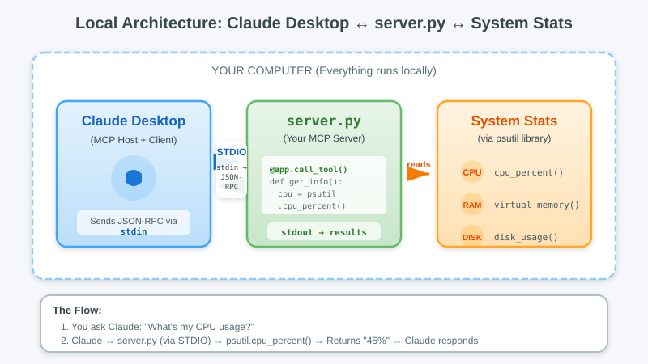
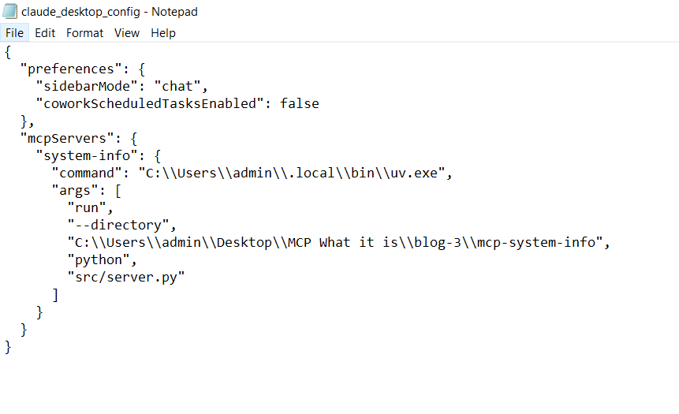
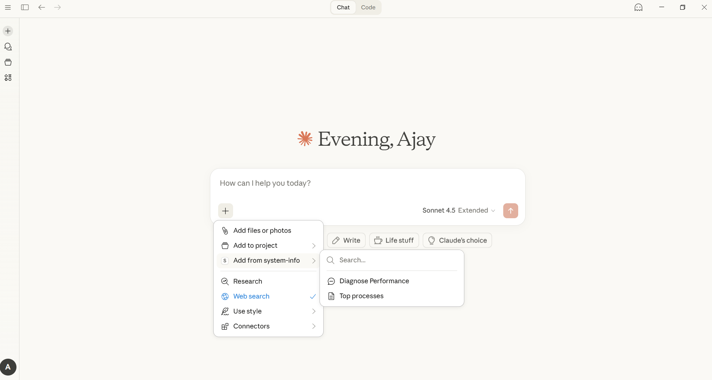
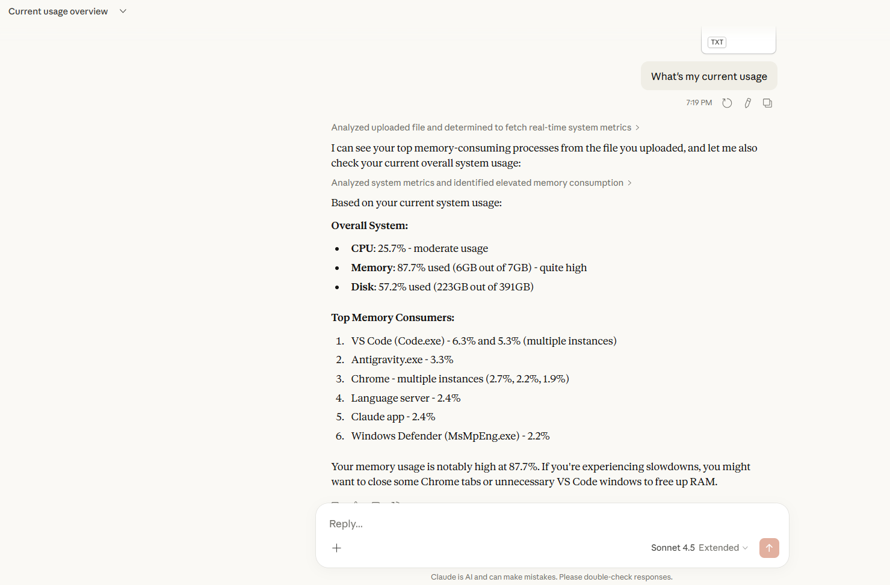

# Your First MCP Server
## Hello World Done Right


> *"Time to get our hands dirty. We're building an MCP server that actually does something useful, a system information server that lets Claude pull live system snapshots on-demand."*

---

## Introduction

In the previous blogs, we covered the theory. We know MCP connects AI models to data via a standardized protocol. We know the architecture: Host → Client → Server.

Today, we stop talking and start coding.

By the end of this tutorial, you'll have a Python script running on your machine that lets Claude Desktop read your CPU usage, analyze your running processes, and tell you why your laptop fan is spinning so loud.

### What We're Building



**Everything runs locally at the MCP layer.** Your server reads data locally and **only what your server returns** becomes tool output. Treat tool output as **data you are sending to the model** (cloud by default). If you're using a cloud-hosted Claude model, that tool output is included in the request to the model provider, so avoid returning secrets.

---

## Prerequisites

Before we start, ensure you have:

| Requirement | How to Check |
|-------------|--------------|
| Python 3.10+ | `python --version` |
| `uv` package manager | `uv --version` (or use pip) |
| Claude Desktop | Download from claude.ai |

If you don't have `uv`, install it:
```bash
# Windows (PowerShell)
powershell -ExecutionPolicy ByPass -c "irm https://astral.sh/uv/install.ps1 | iex"

# macOS/Linux
curl -LsSf https://astral.sh/uv/install.sh | sh
```

---

## 1. Project Setup

We're not just writing a script, we're building a proper Python project.

### Step 1: Create the Project

Open your terminal:

```bash
# Create project directory
mkdir mcp-system-info
cd mcp-system-info

# Initialize with uv
uv init

# Add dependencies (includes CLI tools for mcp install, mcp dev)
uv add "mcp[cli]" psutil
```

### Step 2: Create the Server File

Create the file `src/server.py` (create the `src` folder if it doesn't exist):

```
mcp-system-info/
├── pyproject.toml      # Created by uv init
├── src/
│   └── server.py       # We'll create this
└── .venv/              # Created by uv
```
---

## 2. The Minimal Server (Skeleton)

Let's start with the absolute minimum code to get an MCP server running. We'll use **FastMCP**, the recommended high-level API.

**Create `src/server.py`:**

```python
from mcp.server.fastmcp import FastMCP

# Create the server instance with a name
mcp = FastMCP("system-info")

if __name__ == "__main__":
    mcp.run()
```

**What's happening:**

| Line | Purpose |
|------|---------|
| `FastMCP("system-info")` | Creates an MCP server with a name (shown in Claude) |
| `mcp.run()` | Starts the server with STDIO transport (default for local) |

That's it! FastMCP handles all the protocol details. This server does nothing yet, it has no tools. Let's fix that.

---

## 3. Adding Your First TOOL

Tools are functions the AI can call. Let's give Claude the ability to read your system stats.

**Replace `src/server.py` with:**

```python
from mcp.server.fastmcp import FastMCP
import psutil
import pathlib

mcp = FastMCP("system-info")

@mcp.tool()
def get_system_info() -> str:
    """Get current CPU, memory, and disk usage of this computer."""
    cpu = psutil.cpu_percent(interval=0.5)
    memory = psutil.virtual_memory()
    # Cross-platform disk root: C:\ on Windows, / on Unix
    disk_root = pathlib.Path.home().anchor or "/"
    disk = psutil.disk_usage(disk_root)
    
    gb = 1024**3
    return (
        f"System Information:\n"
        f"- CPU Usage: {cpu}%\n"
        f"- Memory: {memory.percent}% used ({memory.used // gb}GB / {memory.total // gb}GB)\n"
        f"- Disk: {disk.percent}% used ({disk.used // gb}GB / {disk.total // gb}GB)"
    )

if __name__ == "__main__":
    mcp.run()
```

**How it works:**

1. `@mcp.tool()` — This decorator registers the function as an MCP tool. FastMCP automatically generates the tool name, description (from docstring), and input schema.

2. **Return type** — Just return a string! FastMCP handles all the protocol details.

3. **No boilerplate** — No manual `list_tools()` or `call_tool()` handlers needed.

---

## 4. Adding a Second Tool (With Arguments)

Let's add a tool that accepts input, searching for a process by name. With FastMCP, just add another decorated function:

**Add this to your `src/server.py`:**

```python
@mcp.tool()
def find_process(name: str, limit: int = 25) -> str:
    """Find running processes by name (case-insensitive)."""
    limit = max(1, min(limit, 50))  # Cap limit to prevent context flooding
    name = (name or "").strip().lower()
    if not name:
        return "Please provide a non-empty process name (e.g., 'chrome', 'python')."
    
    found = []
    # Note: cpu_percent returns 0 on first call, so we use memory_percent
    for proc in psutil.process_iter(['pid', 'name', 'memory_percent']):
        try:
            pname = (proc.info.get('name') or '').lower()
            if name in pname:
                found.append(
                    f"PID {proc.info['pid']}: {proc.info.get('name', '?')} "
                    f"(Memory: {(proc.info.get('memory_percent') or 0):.1f}%)"
                )
                if len(found) >= limit:
                    break
        except (psutil.NoSuchProcess, psutil.AccessDenied):
            continue
    
    if not found:
        return f"No processes found matching '{name}'."
    return "Found processes:\n" + "\n".join(found)
```

**What's different from the low-level API:**

- **Type hints become the schema** — `name: str` automatically creates a required string parameter
- **Default values work** — `limit: int = 25` creates an optional parameter with default
- **Docstring becomes description** — FastMCP extracts it for the tool listing
- **Empty string validation** — We added explicit validation since users might pass empty strings

Now Claude can ask: *"Find all Chrome processes"* and your tool will return the actual PIDs and memory usage.

> **Privacy Note:** The `find_process` tool exposes process names and PIDs. Only expose what you're comfortable sharing, tool outputs become part of the conversation context.

---

## 5. Adding a RESOURCE

Resources are read-only data sources. Unlike tools (which the AI calls on-demand), resources are data the user or application can attach to the conversation.

**Add this to your `src/server.py`:**

```python
@mcp.resource("system://top-processes", title="Top Processes")
def top_processes() -> str:
    """Top 10 memory-consuming processes on this machine."""
    procs = []
    for p in psutil.process_iter(['name', 'memory_percent']):
        try:
            procs.append((p.info.get('name') or '?', p.info.get('memory_percent') or 0.0))
        except (psutil.NoSuchProcess, psutil.AccessDenied):
            continue
    
    procs.sort(key=lambda x: x[1], reverse=True)
    lines = [f"- {name}: {mem:.1f}%" for name, mem in procs[:10]]
    return "Top 10 by Memory:\n" + "\n".join(lines)
```

**Key difference from Tools:**
- `@mcp.resource("uri://...")` — Resources have URIs
- Resources are read-only—no side effects
- Resources are pulled when the host/user attaches them (not automatically)
- Just return a string—FastMCP handles the rest

---

## 6. Adding a PROMPT

Prompts are pre-built conversation starters. Instead of the user typing a complex question, they select a prompt that pre-loads context.

**Add this to your `src/server.py`:**

```python
@mcp.prompt(title="Diagnose Performance")
def diagnose_performance(symptom: str = "general slowness") -> str:
    """Prompt that includes live CPU/memory snapshot."""
    cpu = psutil.cpu_percent(interval=0.5)
    mem = psutil.virtual_memory()
    return (
        f"I'm experiencing: {symptom}\n\n"
        "Current System State:\n"
        f"- CPU: {cpu:.1f}%\n"
        f"- Memory: {mem.percent:.1f}%\n\n"
        "Please analyze this and suggest fixes."
    )
```

When a user selects this prompt in Claude Desktop, it automatically fetches the current CPU/memory and creates a ready-to-go diagnostic question.

---

## 7. Complete Server Code

**Replace the entire contents of `src/server.py` with the following:**

```python
# src/server.py - MCP System Info Server (FastMCP)
from mcp.server.fastmcp import FastMCP
import psutil
import pathlib
import logging
import sys

# Safe logging setup (NEVER use print() - it corrupts STDIO transport)
logging.basicConfig(stream=sys.stderr, level=logging.INFO)
log = logging.getLogger("system-info")

mcp = FastMCP("system-info")


# ============ TOOLS ============

@mcp.tool()
def get_system_info() -> str:
    """Get current CPU, memory, and disk usage of this computer."""
    cpu = psutil.cpu_percent(interval=0.5)
    mem = psutil.virtual_memory()
    # Cross-platform disk root: C:\\ on Windows, / on Unix
    disk_root = pathlib.Path.home().anchor or "/"
    disk = psutil.disk_usage(disk_root)
    
    gb = 1024**3
    return (
        "System Information:\n"
        f"- CPU Usage: {cpu:.1f}%\n"
        f"- Memory: {mem.percent:.1f}% used ({mem.used // gb}GB / {mem.total // gb}GB)\n"
        f"- Disk: {disk.percent:.1f}% used ({disk.used // gb}GB / {disk.total // gb}GB)"
    )


@mcp.tool()
def find_process(name: str, limit: int = 25) -> str:
    """Find running processes by name (case-insensitive)."""
    limit = max(1, min(limit, 50))  # Cap limit to prevent context flooding
    name = (name or "").strip().lower()
    if not name:
        return "Please provide a non-empty process name (e.g., 'chrome', 'python')."
    
    found = []
    for proc in psutil.process_iter(['pid', 'name', 'memory_percent']):
        try:
            pname = (proc.info.get('name') or '').lower()
            if name in pname:
                found.append(
                    f"PID {proc.info['pid']}: {proc.info.get('name', '?')} "
                    f"(Memory: {(proc.info.get('memory_percent') or 0):.1f}%)"
                )
                if len(found) >= limit:
                    break
        except (psutil.NoSuchProcess, psutil.AccessDenied):
            continue
    
    if not found:
        return f"No processes found matching '{name}'."
    return "Found processes:\n" + "\n".join(found)


# ============ RESOURCES ============

@mcp.resource("system://top-processes")
def top_processes() -> str:
    """Top 10 memory-consuming processes on this machine."""
    procs = []
    for p in psutil.process_iter(['name', 'memory_percent']):
        try:
            procs.append((p.info.get('name') or '?', p.info.get('memory_percent') or 0.0))
        except (psutil.NoSuchProcess, psutil.AccessDenied):
            continue
    
    procs.sort(key=lambda x: x[1], reverse=True)
    lines = [f"- {name}: {mem:.1f}%" for name, mem in procs[:10]]
    return "Top 10 by Memory:\n" + "\n".join(lines)


# ============ PROMPTS ============

@mcp.prompt(title="Diagnose Performance")
def diagnose_performance(symptom: str = "general slowness") -> str:
    """Prompt that includes live CPU/memory snapshot."""
    cpu = psutil.cpu_percent(interval=0.5)
    mem = psutil.virtual_memory()
    return (
        f"I'm experiencing: {symptom}\n\n"
        "Current System State:\n"
        f"- CPU: {cpu:.1f}%\n"
        f"- Memory: {mem.percent:.1f}%\n\n"
        "Please analyze this and suggest fixes."
    )


# ============ MAIN ============

if __name__ == "__main__":
    mcp.run()
```

---

## 8. Connecting to Claude Desktop

Now for the magic moment. We need to tell Claude Desktop where your server is.

### Option A: Quick Install (Recommended)

The MCP CLI can auto-configure Claude Desktop for you:

```bash
cd mcp-system-info
uv add "mcp[cli]"   # if not already installed
uv run mcp install src/server.py
```

This automatically adds the server to your Claude Desktop config. Restart Claude Desktop and you're done!

> **Note:** The CLI tools require `mcp[cli]` which we installed earlier. If `mcp install` fails, verify with `uv add "mcp[cli]"`.

> **Dev mode:** You can also test interactively with `uv run mcp dev src/server.py` which opens the MCP Inspector.

> **Heads up:** `mcp install` uses `--frozen --with mcp[cli] mcp run` internally, which downloads packages at startup. If your network is slow, Claude Desktop may time out before the server responds. If you hit _"Could not attach to MCP server"_, skip to **Option B** below, it starts instantly because dependencies are already installed via `uv sync`.

### Option B: Manual Configuration (Recommended if Option A fails)

If `mcp install` doesn't work, or you see connection errors, configure manually:

#### Step 1: Find the Config File

| OS | Path |
|----|------|
| **Windows** | `%APPDATA%\Claude\claude_desktop_config.json` |
| **macOS** | `~/Library/Application Support/Claude/claude_desktop_config.json` |

If the file doesn't exist, create it.

> **Note:** Some MCP clients (like Cursor, VS Code extensions) use a different format called `mcp.json`. The structure is similar but not identical. We focus on Claude Desktop's format here, the concepts transfer to other clients.

#### Step 2: Add Your Server

Open the config file and add your server.

> **Important:** Use the **full absolute path** to `uv` itself, not just `"uv"`. Claude Desktop launches as a GUI app and may not see your shell's PATH additions (like `~/.local/bin`). Find your `uv` path with:
>
> ```powershell
> # Windows
> Get-Command uv | Select-Object -ExpandProperty Source
> # macOS/Linux
> which uv
> ```

**Windows example:**

>  **Windows Users:** You MUST use double backslashes (`\\`) in JSON paths




**macOS/Linux example:**
```json
{
  "mcpServers": {
    "system-info": {
      "command": "/Users/yourname/.local/bin/uv",
      "args": [
        "run",
        "--directory",
        "/Users/yourname/mcp-system-info",
        "python",
        "src/server.py"
      ]
    }
  }
}
```

> **Important:** Use absolute paths for both the `uv` command AND the project directory. Relative paths won't work.

#### Step 3: Quit and Restart Claude Desktop

Claude only reads the config file on startup. If it's already running, your changes won't take effect.

1. **Quit completely** (not just close the window):
   - **Windows:** Right-click the Claude icon in the **system tray** (bottom-right of taskbar, you may need to click the `^` arrow to find it) → **Quit**
   - **macOS:** `Cmd+Q` (clicking the red X doesn't quit the app!)
2. **Important:** Make sure ALL Claude processes are gone. On Windows, check Task Manager — if you see multiple `claude.exe` processes from hours ago, kill them all. Zombie processes prevent the new instance from reading the updated config.
3. Reopen Claude Desktop

> **Pro tip:** If Claude still won't restart cleanly, force-kill from terminal:
> ```powershell
> # Windows
> Stop-Process -Name "claude" -Force
> # macOS
> pkill -9 Claude
> ```

#### Step 4: Find Your Tools

Once Claude Desktop opens with a working MCP server, look for the **"+" button** next to the chat input area. Click it — you'll see your MCP tools listed there:



> **Note:** In some Claude Desktop versions, tools appear under a **🔨 hammer icon** instead of the **+** button. Either way, your `system-info` tools will be listed there.

#### Step 5: Test It!

Type in Claude:

> "What's my current CPU usage?"

You should see:
1. Claude shows "Using tool: get_system_info"
2. A permission dialog appears (click Allow)
3. Claude responds with your actual CPU percentage



Try these too:
- "Find all Chrome processes"
- "Is anything using too much memory?"
- "Why is my computer slow?"

---

## 9. Troubleshooting

MCP is young, and connecting your first server can be frustrating. Here are the **real issues** you'll likely hit, and exactly how to fix them.

### Server Not Appearing?

**Check 1: Is `uv` findable by Claude Desktop?**

This is the #1 issue. Claude Desktop is a GUI app and may not inherit your terminal's PATH. Use the **full absolute path** to `uv` in your config:

```powershell
# Find your uv path
Get-Command uv | Select-Object -ExpandProperty Source
# Example output: C:\Users\admin\.local\bin\uv.exe
```

Then use that full path in `"command"`, not just `"uv"`.

**Check 2: Path is correct**
```powershell
# Windows - verify path exists
Test-Path "C:\Users\YourName\mcp-system-info\src\server.py"
```

**Check 3: Server runs standalone**
```bash
cd mcp-system-info
uv run python src/server.py
```
It should hang (waiting for input). If it exits immediately, read the traceback, that's your root cause.

**Check 4: JSON syntax, no BOM!**

Your config must be valid JSON. On Windows, some editors add a **UTF-8 BOM** (Byte Order Mark) to the file, which breaks Claude Desktop's JSON parser. If you see _"Could not read app settings"_, check for BOM:

```powershell
# Check first bytes — should start with 7B ({), NOT EF BB BF
Format-Hex "$env:APPDATA\Claude\claude_desktop_config.json" | Select-Object -First 2

# Fix: rewrite without BOM
$content = Get-Content "$env:APPDATA\Claude\claude_desktop_config.json" -Raw
$utf8NoBom = New-Object System.Text.UTF8Encoding $false
[System.IO.File]::WriteAllText("$env:APPDATA\Claude\claude_desktop_config.json", $content, $utf8NoBom)
```

### "Could not attach to MCP server"

This means Claude Desktop **found** your server but it **timed out** during startup. Common causes:

1. **`mcp install` uses `--frozen --with mcp[cli]`** which downloads packages at startup. If this is slow, Claude kills the connection. Fix: use the manual config (Option B) with `uv run --directory ... python src/server.py` instead.

2. **Dependencies not synced.** Run `uv sync` in your project directory first so packages are cached locally:
   ```bash
   cd mcp-system-info
   uv sync
   ```

### Zombie Processes (Windows)

If you close Claude Desktop's window but don't **Quit**, the old process stays running. Next time you open Claude, it starts as a "secondary instance" that **never reads the config**. You'll see the UI but no MCP servers.

**Fix:** Kill all Claude processes and restart:
```powershell
# Kill all zombie Claude processes
Stop-Process -Name "claude" -Force

# Wait, then reopen
Start-Sleep -Seconds 3
Start-Process "$env:LOCALAPPDATA\AnthropicClaude\claude.exe"
```

### Common Errors

| Error | Cause | Fix |
|-------|-------|-----|
| Server not showing / no tools icon | Claude was already running as zombie | Kill all `claude.exe` processes and restart |
| Server not showing | `uv` not found by Claude Desktop | Use absolute path to `uv.exe` in config |
| "Could not read app settings" | UTF-8 BOM in config file | Rewrite file without BOM (see above) |
| "Could not attach to MCP server" | Server startup too slow | Use manual config (Option B), run `uv sync` first |
| "Server exited immediately" | Python error or missing deps | Run `uv run python src/server.py` manually |
| "Unknown tool" | Tool name mismatch | Check the function name in `@mcp.tool()` |
| "No module named mcp" | Dependencies not installed | Run `uv add "mcp[cli]" psutil` |
| Initialize fails / Malformed JSON | Server printed to stdout | Use `stderr` for logs, never `print()` |

> **Critical STDIO Rule:** Never use `print()` in your server! STDIO transport uses stdout for JSON-RPC messages. If your server prints debug output to stdout, it corrupts the protocol.
>
> **Use this logging setup instead:**
> ```python
> import logging, sys
> logging.basicConfig(stream=sys.stderr, level=logging.INFO)
> log = logging.getLogger("system-info")
> 
> # Now use log.info(), log.error() instead of print()
> log.info("Server started")  # Goes to stderr, safe
> print("Debug")              # Corrupts JSON-RPC on stdout
> ```

### Check Claude Logs

When things go wrong, Claude Desktop writes detailed MCP logs:

| OS | Log Path |
|----|----------|
| Windows | `%APPDATA%\Claude\logs\mcp-server-system-info.log` |
| macOS | `~/Library/Logs/Claude/mcp*.log` |

```powershell
# View the last 30 lines of the MCP log
Get-Content "$env:APPDATA\Claude\logs\mcp-server-system-info.log" -Tail 30
```

Look for errors like `ModuleNotFoundError`, `FileNotFoundError`, or connection timeouts.

---

## Key Takeaways

```
 MCP servers are Python scripts that run locally on your machine

 @mcp.tool() = Actions the AI can perform

 @mcp.resource("uri://...") = Read-only data the AI can access

 @mcp.prompt() = Pre-built conversation templates

 claude_desktop_config.json connects Claude to your server

 MCP runs locally, but tool output may be sent to the model provider—don't return secrets
```

---

## What's Next?

You just built an MCP **Server**. You used Claude Desktop as the **Host** (it manages the MCP client connections to your server).

But what if *you* want to build the client? What if you want your own terminal app that talks to any MCP server?

In **Blog 4: Building Your Own MCP Client**, we'll:
- Connect to MCP servers programmatically
- Discover tools automatically
- Build a CLI chatbot with tool-calling
- Understand the full request loop

You'll go from "I can build servers" to "I can build the whole system."

---

## Quick Reference

### Project Structure
```
mcp-system-info/
├── pyproject.toml
├── src/
│   └── server.py
└── .venv/
```

### Decorator Cheat Sheet (FastMCP)
| Decorator | Purpose |
|-----------|---------|
| `@mcp.tool()` | Register a function as a callable tool |
| `@mcp.resource("uri://...")` | Register a read-only data source |
| `@mcp.prompt()` | Register a prompt template |

### CLI Commands
| Command | Purpose |
|---------|---------|
| `uv run mcp install server.py` | Auto-configure Claude Desktop |
| `uv run mcp dev server.py` | Test with MCP Inspector |
| `uv run python server.py` | Run server directly |

### Config Location
| OS | Path |
|----|------|
| Windows | `%APPDATA%\Claude\claude_desktop_config.json` |
| macOS | `~/Library/Application Support/Claude/claude_desktop_config.json` |

---

*Previous blog: [← Blog 2: MCP Architecture Deep Dive](../blog-2/blog.md)*
*Next up: [Blog 4: Building Your Own MCP Client →](../blog-4/blog.md)*