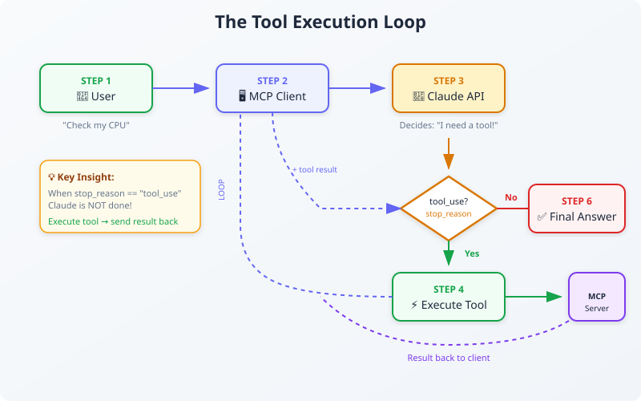
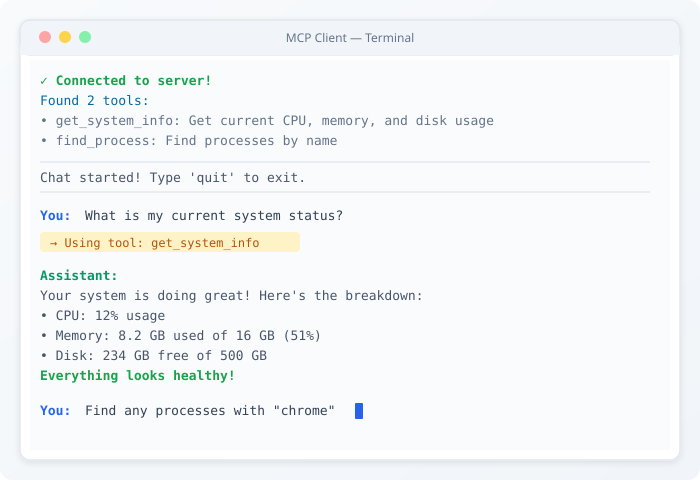

# Building Your Own MCP Client
## From Plugin Developer to Application Architect


> *"Everyone teaches you to build servers. But the real power comes when you build your own client. That's when you stop being a plugin developer and start being an Application Architect."*

---

## Introduction

In Blog 3, we built a server. We relied on Claude Desktop (an MCP Host) to connect to it and decide when to call tools.

Today, we're building our own Host.

> **Terminology note:** In MCP, *this CLI app is the Host*, the user-facing application that runs the tool loop and decides how to use an LLM. Inside it, we instantiate an MCP *ClientSession* (a "client") to maintain a connection to one server. Many docs casually call the whole app "an MCP client," but the strict breakdown is **Host** (app) + **Client** (connection). We'll use both terms where appropriate.

We're going to build a **CLI Chatbot from scratch** that can:
1. Connect to any MCP server via stdio (including the one you built in Blog 3)
2. Auto-discover available tools
3. Use any LLM (Claude, GPT, or Gemini) to decide *when* to use those tools
4. Execute the tools and feed results back to the AI

> This client supports **three LLM providers** out of the box: Anthropic (Claude), OpenAI (GPT), and Google (Gemini). Set one environment variable to switch.

> **Note:** This blog covers **stdio transport** (launching servers as subprocesses). Remote servers using Streamable HTTP require a different transport, we'll cover that in a future blog.

This is the "Hello World" of Agentic AI. You're building the Host that controls everything.

---

## 1. Understanding the Tool Execution Loop

Before we code, we need to understand the **Tool Execution Loop**. This is the heartbeat of any AI agent.



Here's the flow:

1. **User** sends a message: *"Check my CPU usage."*
2. **Your Host** (our CLI app) sends message + available tools to LLM (Claude API)
3. **LLM** sees the tools and returns `stop_reason: "tool_use"`
4. **Your Host** pauses, executes the tool via MCP Client, gets the result
5. **Your Host** sends the result back to the LLM
6. **LLM** generates the final answer: *"Your CPU is at 12%."*

We have to build this loop manually. Claude Desktop does this for you, but we're building our own Host.

---

## Prerequisites

Before we start:

| Requirement | How to Get It |
|-------------|---------------|
| Python 3.10+ | python.org |
| API key for **one** of: | |
| → Anthropic (Claude) | console.anthropic.com |
| → OpenAI (GPT) | platform.openai.com |
| → Google (Gemini) | aistudio.google.com |
| MCP Server from Blog 3 | Previous tutorial |

---

## 2. Project Setup

Create a new project separate from your server:

```bash
mkdir mcp-client
cd mcp-client
uv init
uv add mcp anthropic openai google-genai python-dotenv
```

Create a `.env` file for your provider config:

```text
# Choose your provider: anthropic, openai, or gemini
LLM_PROVIDER=anthropic

# Fill in the key for your chosen provider:
ANTHROPIC_API_KEY=sk-ant-api03-your-key-here
OPENAI_API_KEY=sk-your-openai-key-here
GOOGLE_API_KEY=your-google-api-key-here

# Optional: override default model
# LLM_MODEL=gpt-4o
```

> Never commit your `.env` file to git!

Your folder structure:

```
mcp-client/
+-- pyproject.toml
+-- .env
+-- src/
    +-- client.py
```

---

## 3. Step 1: Connecting to a Server

Create `src/client.py`. First, we need to launch the server process and establish an MCP session.

> **Note:** The snippets in Steps 1-3 are for explanation only. The complete, copy-paste-ready code is in [Section 6](#6-complete-client-implementation), which includes `load_dotenv()` and proper error handling.

```python
import asyncio
from mcp import ClientSession, StdioServerParameters
from mcp.client.stdio import stdio_client

async def connect_to_server(command: str, args: list[str]) -> ClientSession:
    # Define how to launch the server
    server_params = StdioServerParameters(
        command=command,
        args=args,
        env=None
    )
    
    # Start the subprocess and connect stdio
    transport = stdio_client(server_params)
    read, write = await transport.__aenter__()
    
    # Initialize the MCP session
    session = ClientSession(read, write)
    await session.__aenter__()
    await session.initialize()
    
    return session
```

**What's happening:**

| Line | Purpose |
|------|---------|
| `StdioServerParameters` | Tells client how to launch the server process |
| `stdio_client()` | Starts the subprocess, connects stdin/stdout |
| `session.initialize()` | Performs MCP handshake (capabilities, version) |

---

## 4. Step 2: Tool Discovery

The MCP server has tools, but each LLM API expects a specific JSON format. We need a translator.

```python
async def get_tools_for_claude(session: ClientSession) -> list[dict]:
    # Ask MCP server what tools it has
    result = await session.list_tools()
    
    # Convert to Anthropic's expected format
    tools = []
    for tool in result.tools:
        tools.append({
            "name": tool.name,
            "description": tool.description,
            "input_schema": tool.inputSchema
        })
    
    return tools
```

This function acts as a bridge, converting MCP's `ListToolsResult` into the format each LLM provider expects. Each provider has a slightly different schema (Anthropic uses `input_schema`, OpenAI wraps tools in `{"type": "function", ...}`, Gemini uses `FunctionDeclaration`).

> **Important:** Claude may request **multiple tools in a single response** (parallel tool use). Your host must execute ALL `tool_use` blocks and send ALL `tool_result` blocks back in one message. We'll handle this in the chat loop.

---

## 5. Step 3: The Chat Loop (The Core)

This is where we act as the Host, orchestrating the conversation between the user, the LLM, and the MCP server.

> The code below uses Anthropic's SDK to illustrate the concept. The complete implementation in [Section 6](#6-complete-multi-provider-implementation) supports all three providers via a clean adapter pattern.

```python
from anthropic import Anthropic

SYSTEM_PROMPT = """You are a CLI assistant with access to local tools via MCP.
Rules:
- If the user asks about system/process info, use the available tools. Do not guess.
- If a tool fails, explain the failure and suggest a next step.
- Keep outputs concise unless asked for detail.
"""

class MCPClient:
    """Our Host application that uses an MCP Client to talk to servers."""
    def __init__(self):
        self.session: ClientSession | None = None
        self.anthropic = Anthropic()  # Reads ANTHROPIC_API_KEY from env
        self.tools: list[dict] = []

    async def process_message(self, user_message: str, messages: list) -> str:
        messages.append({"role": "user", "content": user_message})
        
        # THE TOOL LOOP (Host controls this)
        while True:
            # 1. Ask Claude (with system prompt for reliable tool use)
            response = self.anthropic.messages.create(
                model="claude-sonnet-4-20250514",
                max_tokens=4096,
                system=SYSTEM_PROMPT,
                tools=self.tools,
                messages=messages
            )
            
            # 2. Did Claude want to use tools?
            if response.stop_reason == "tool_use":
                # IMPORTANT: Claude can request MULTIPLE tools in one response!
                tool_uses = [b for b in response.content if b.type == "tool_use"]
                
                # Add Claude's response to history first
                messages.append({"role": "assistant", "content": response.content})
                
                # 3. Execute ALL requested tools
                tool_results = []
                for tool_use in tool_uses:
                    print(f"Calling tool: {tool_use.name}...")
                    
                    try:
                        result = await self.session.call_tool(
                            tool_use.name, 
                            tool_use.input
                        )
                        # Extract text from MCP result (may have multiple blocks)
                        tool_result_text = "\n".join(
                            c.text for c in result.content if hasattr(c, 'text')
                        ).strip() or "(no output)"
                    except Exception as e:
                        # Don't crash! Return error as tool result
                        tool_result_text = f"TOOL_ERROR: {type(e).__name__}: {e}"
                    
                    tool_results.append({
                        "type": "tool_result",
                        "tool_use_id": tool_use.id,
                        "content": tool_result_text
                    })
                
                # 4. Send ALL tool results back in ONE message
                messages.append({"role": "user", "content": tool_results})
                # Loop continues - Claude will process the tool results
                
            else:
                # No tool use - extract final answer (may have multiple text blocks)
                final_text = "\n".join(
                    b.text for b in response.content if hasattr(b, 'text')
                ).strip()
                messages.append({"role": "assistant", "content": response.content})
                return final_text or f"(No text output. stop_reason={response.stop_reason})"
```

**Key insights:**

1. **Multiple tool calls:** Claude can request multiple tools in one response (parallel tool use). We must execute ALL of them and send ALL results back in a single `user` message.

2. **Error handling:** If a tool fails, don't crash! Send the error back as a `tool_result` so Claude can explain the failure to the user.

3. **System prompt:** Adding a system prompt ensures Claude uses tools for real data instead of guessing.

4. When Claude returns `stop_reason == "tool_use"`, it is NOT done. It's asking us to execute tools and send results back. We loop until Claude gives us a final text response.

---

## 6. Complete Multi-Provider Implementation

Here's the full code with support for **Anthropic**, **OpenAI**, and **Google Gemini**. Copy this to `src/client.py`:

### The Provider Pattern

The secret sauce: an abstract `LLMProvider` class that each provider implements. Our `MCPHostCLI` doesn't care *which* LLM it's talking to, it just calls `provider.send()`, `provider.add_tool_results()`, etc.

```
                     ┌─────────────────┐
                     │   LLMProvider   │  (abstract base)
                     │  format_tools() │
                     │     send()      │
                     │  add_user_msg() │
                     └──────┬──────────┘
              ┌─────────────┼──────────────┐
              ▼             ▼              ▼
     ┌──────────────┐ ┌──────────┐ ┌──────────────┐
     │  Anthropic   │ │  OpenAI  │ │   Gemini     │
     │ (Claude API) │ │ (GPT API)│ │ (Google API) │
     └──────────────┘ └──────────┘ └──────────────┘
```

Each provider handles three things:
1. **Format translation** — Convert MCP tool schemas to what the provider expects
2. **API calls** — Send messages in the provider's native format
3. **Message history** — Each provider has its own message structure

### Full Code

```python
# src/client.py - Multi-Provider MCP Host (CLI)
# Blog 4: Building Your Own MCP Client
# Supports: Anthropic (Claude), OpenAI (GPT), Google (Gemini)

import asyncio
import json
import os
from abc import ABC, abstractmethod
from dataclasses import dataclass, field
from dotenv import load_dotenv

from mcp import ClientSession, StdioServerParameters
from mcp.client.stdio import stdio_client

load_dotenv()

SYSTEM_PROMPT = """You are a CLI assistant with access to local tools via MCP.
Rules:
- If the user asks about system/process info, use the available tools. Do not guess.
- If a tool fails, explain the failure and suggest a next step.
- Keep outputs concise unless asked for detail.
"""


# ─── Unified types ────────────────────────────────────────────


@dataclass
class ToolCall:
    """Provider-agnostic representation of a tool call request."""
    id: str
    name: str
    arguments: dict


@dataclass
class LLMResponse:
    """Unified response from any LLM provider."""
    tool_calls: list[ToolCall] = field(default_factory=list)
    text: str | None = None
    raw: object = None  # provider-specific data for message history


# ─── Provider base class ──────────────────────────────────────


class LLMProvider(ABC):
    """Each subclass translates between its native API and our unified types."""

    @property
    @abstractmethod
    def name(self) -> str: ...

    @abstractmethod
    def format_tools(self, mcp_tools: list[dict]) -> list: ...

    @abstractmethod
    def send(self, messages: list, tools: list, system: str) -> LLMResponse: ...

    @abstractmethod
    def add_user_message(self, messages: list, text: str): ...

    @abstractmethod
    def add_assistant_response(self, messages: list, response: LLMResponse): ...

    @abstractmethod
    def add_tool_results(self, messages: list, results: list[tuple[ToolCall, str]]): ...


# ─── Anthropic (Claude) ──────────────────────────────────────


class AnthropicProvider(LLMProvider):
    def __init__(self, model: str | None = None):
        from anthropic import Anthropic
        self.client = Anthropic()
        self.model = model or "claude-sonnet-4-20250514"

    @property
    def name(self) -> str:
        return f"Anthropic ({self.model})"

    def format_tools(self, mcp_tools):
        return [
            {"name": t["name"], "description": t["description"],
             "input_schema": t["input_schema"]}
            for t in mcp_tools
        ]

    def send(self, messages, tools, system):
        resp = self.client.messages.create(
            model=self.model, max_tokens=2048, system=system,
            tools=tools, messages=messages,
        )
        if resp.stop_reason == "tool_use":
            calls = [
                ToolCall(id=b.id, name=b.name, arguments=b.input)
                for b in resp.content if getattr(b, "type", None) == "tool_use"
            ]
            return LLMResponse(tool_calls=calls, raw=resp.content)
        text = "\n".join(
            getattr(b, "text", "") for b in resp.content if getattr(b, "text", None)
        ).strip()
        return LLMResponse(text=text or "(no output)", raw=resp.content)

    def add_user_message(self, messages, text):
        messages.append({"role": "user", "content": text})

    def add_assistant_response(self, messages, response):
        messages.append({"role": "assistant", "content": response.raw})

    def add_tool_results(self, messages, results):
        messages.append({"role": "user", "content": [
            {"type": "tool_result", "tool_use_id": tc.id, "content": text}
            for tc, text in results
        ]})


# ─── OpenAI (GPT) ────────────────────────────────────────────


class OpenAIProvider(LLMProvider):
    def __init__(self, model: str | None = None):
        from openai import OpenAI
        self.client = OpenAI()
        self.model = model or "gpt-4o"

    @property
    def name(self) -> str:
        return f"OpenAI ({self.model})"

    def format_tools(self, mcp_tools):
        # OpenAI wraps each tool in {"type": "function", "function": {...}}
        return [
            {"type": "function", "function": {
                "name": t["name"], "description": t["description"],
                "parameters": t["input_schema"],
            }}
            for t in mcp_tools
        ]

    def send(self, messages, tools, system):
        # OpenAI puts the system prompt in the messages array
        full = [{"role": "system", "content": system}] + messages
        resp = self.client.chat.completions.create(
            model=self.model, messages=full, tools=tools or None,
        )
        msg = resp.choices[0].message
        if msg.tool_calls:
            calls = [
                ToolCall(
                    id=tc.id, name=tc.function.name,
                    arguments=json.loads(tc.function.arguments),
                )
                for tc in msg.tool_calls
            ]
            return LLMResponse(tool_calls=calls, raw=msg)
        return LLMResponse(text=msg.content or "(no output)", raw=msg)

    def add_user_message(self, messages, text):
        messages.append({"role": "user", "content": text})

    def add_assistant_response(self, messages, response):
        msg = response.raw
        entry = {"role": "assistant", "content": msg.content}
        if msg.tool_calls:
            entry["tool_calls"] = [
                {"id": tc.id, "type": "function",
                 "function": {"name": tc.function.name,
                              "arguments": tc.function.arguments}}
                for tc in msg.tool_calls
            ]
        messages.append(entry)

    def add_tool_results(self, messages, results):
        # OpenAI: each tool result is a separate message with role="tool"
        for tc, text in results:
            messages.append({"role": "tool", "tool_call_id": tc.id, "content": text})


# ─── Google Gemini ────────────────────────────────────────────


def _clean_schema_for_gemini(schema: dict) -> dict:
    """Strip JSON Schema keys that Gemini doesn't support."""
    skip = {"additionalProperties", "$schema"}
    out = {}
    for k, v in schema.items():
        if k in skip:
            continue
        if isinstance(v, dict):
            out[k] = _clean_schema_for_gemini(v)
        elif isinstance(v, list):
            out[k] = [_clean_schema_for_gemini(i) if isinstance(i, dict) else i
                       for i in v]
        else:
            out[k] = v
    return out


class GeminiProvider(LLMProvider):
    def __init__(self, model: str | None = None):
        from google import genai
        self.client = genai.Client()  # reads GOOGLE_API_KEY from env
        self.model = model or "gemini-2.5-flash"

    @property
    def name(self) -> str:
        return f"Gemini ({self.model})"

    def format_tools(self, mcp_tools):
        from google.genai import types
        declarations = []
        for t in mcp_tools:
            schema = _clean_schema_for_gemini(t["input_schema"])
            declarations.append(types.FunctionDeclaration(
                name=t["name"], description=t["description"],
                parameters=schema if schema.get("properties") else None,
            ))
        return [types.Tool(function_declarations=declarations)]

    def send(self, messages, tools, system):
        from google.genai import types
        resp = self.client.models.generate_content(
            model=self.model, contents=messages,
            config=types.GenerateContentConfig(
                system_instruction=system, tools=tools,
            ),
        )
        parts = resp.candidates[0].content.parts
        calls = [
            ToolCall(
                id=f"call_{p.function_call.name}_{i}",
                name=p.function_call.name,
                arguments=dict(p.function_call.args) if p.function_call.args else {},
            )
            for i, p in enumerate(parts) if p.function_call
        ]
        if calls:
            return LLMResponse(tool_calls=calls, raw=resp)
        return LLMResponse(text=resp.text or "(no output)", raw=resp)

    def add_user_message(self, messages, text):
        from google.genai import types
        messages.append(types.Content(
            role="user", parts=[types.Part.from_text(text=text)]
        ))

    def add_assistant_response(self, messages, response):
        if hasattr(response.raw, "candidates"):
            messages.append(response.raw.candidates[0].content)

    def add_tool_results(self, messages, results):
        from google.genai import types
        parts = [
            types.Part.from_function_response(
                name=tc.name, response={"result": text}
            )
            for tc, text in results
        ]
        messages.append(types.Content(role="user", parts=parts))


# ─── Provider factory ────────────────────────────────────────

PROVIDERS = {
    "anthropic": ("ANTHROPIC_API_KEY", AnthropicProvider),
    "openai":    ("OPENAI_API_KEY",    OpenAIProvider),
    "gemini":    ("GOOGLE_API_KEY",    GeminiProvider),
}

def get_provider(name: str, model: str | None = None) -> LLMProvider:
    name = name.lower()
    if name not in PROVIDERS:
        raise ValueError(f"Unknown provider '{name}'. Choose: {', '.join(PROVIDERS)}")
    env_key, cls = PROVIDERS[name]
    if not os.getenv(env_key):
        raise ValueError(f"{env_key} not set. Add it to your .env file.")
    return cls(model=model)


# ─── MCP Host CLI ─────────────────────────────────────────────

def _extract_text_from_mcp_result(call_tool_result) -> str:
    parts = []
    for c in getattr(call_tool_result, "content", []) or []:
        text = getattr(c, "text", None)
        if text:
            parts.append(text)
    return "\n".join(parts).strip() or "(no text content returned)"


class MCPHostCLI:
    """
    Host app: connects to one MCP server, uses ANY LLM provider
    for the tool-execution loop.
    """
    def __init__(self, provider: LLMProvider):
        self.provider = provider
        self.session: ClientSession | None = None
        self.mcp_tools: list[dict] = []
        self.llm_tools: list = []
        self._transport_cm = None
        self._read = None
        self._write = None

    async def connect(self, command: str, args: list[str], env: dict | None = None):
        server_params = StdioServerParameters(command=command, args=args, env=env)
        self._transport_cm = stdio_client(server_params)
        self._read, self._write = await self._transport_cm.__aenter__()
        self.session = ClientSession(self._read, self._write)
        await self.session.__aenter__()
        await self.session.initialize()

        tool_result = await self.session.list_tools()
        self.mcp_tools = [
            {"name": t.name, "description": t.description,
             "input_schema": t.inputSchema}
            for t in tool_result.tools
        ]
        self.llm_tools = self.provider.format_tools(self.mcp_tools)

        print(f"\n✓ Connected ({self.provider.name}). Found {len(self.mcp_tools)} tools:")
        for t in self.mcp_tools:
            print(f"  - {t['name']}: {t['description']}")

    async def close(self):
        if self.session is not None:
            await self.session.__aexit__(None, None, None)
            self.session = None
        if self._transport_cm is not None:
            await self._transport_cm.__aexit__(None, None, None)
            self._transport_cm = None

    async def chat(self, user_message: str, messages: list) -> str:
        if not self.session:
            raise RuntimeError("Not connected to an MCP server.")

        self.provider.add_user_message(messages, user_message)

        while True:
            response = self.provider.send(messages, self.llm_tools, SYSTEM_PROMPT)

            if response.tool_calls:
                self.provider.add_assistant_response(messages, response)
                results = []
                for tc in response.tool_calls:
                    print(f"\n  → Using tool: {tc.name}")
                    try:
                        mcp_result = await self.session.call_tool(tc.name, tc.arguments)
                        text = _extract_text_from_mcp_result(mcp_result)
                    except Exception as e:
                        text = f"TOOL_ERROR: {type(e).__name__}: {e}"
                    results.append((tc, text))

                self.provider.add_tool_results(messages, results)
                continue

            self.provider.add_assistant_response(messages, response)
            return response.text or "(no output)"

    async def run_cli(self):
        print("\n" + "=" * 50)
        print("Chat started! Type 'quit' to exit.")
        print("=" * 50 + "\n")
        messages: list = []

        while True:
            try:
                user_input = input("You: ").strip()
                if user_input.lower() in {"quit", "exit", "q"}:
                    break
                if not user_input:
                    continue
                response = await self.chat(user_input, messages)
                print(f"\nAssistant:\n{response}\n")
            except KeyboardInterrupt:
                break


async def main():
    provider_name = os.getenv("LLM_PROVIDER", "anthropic")
    model = os.getenv("LLM_MODEL")  # None = use provider default

    try:
        provider = get_provider(provider_name, model)
    except ValueError as e:
        print(f"Error: {e}")
        return

    host = MCPHostCLI(provider)

    try:
        # UPDATE THIS PATH to your Blog 3 server location!
        await host.connect(
            command="uv",
            args=["run", "--directory",
                  r"C:\Users\YourName\mcp-system-info",
                  "python", "src/server.py"],
        )
        await host.run_cli()
    finally:
        await host.close()
        print("\nDisconnected. Goodbye!")

if __name__ == "__main__":
    asyncio.run(main())
```

**What's different from the simplified snippets:**

| Feature | Why It Matters |
|---------|----------------|
| `LLMProvider` abstraction | Swap Claude / GPT / Gemini with one env var |
| `close()` method | Cleans up session + transport (prevents leaked subprocesses) |
| `try/finally` in `main()` | Ensures cleanup even on errors |
| Multiple tool-call handling | All three providers can request parallel tool calls |
| Error-to-tool_result | Tool failures don't crash the host |
| Provider-specific message history | Each LLM handles message format differently |

---

## 7. Testing Your Client

### Step 1: Update the Server Path

In `main()`, update the path to your Blog 3 server:

```python
await host.connect(
    command="uv",
    args=["run", "--directory", "C:\\Users\\YourName\\mcp-system-info", "python", "src/server.py"]
)
```

> **WINDOWS USERS: This is the #1 source of errors!**
> - Use **double backslashes** in the path: `C:\\Users\\...`
> - Use the **full absolute path** to your Blog 3 server
> - If you see "Server process failed to start", the path is wrong

### Step 2: Choose Your Provider

Edit `.env` to select your LLM:

```text
# Use whichever provider you have credits for:
LLM_PROVIDER=openai
OPENAI_API_KEY=sk-your-key-here
```

| Provider | `LLM_PROVIDER` | API Key Variable | Default Model |
|----------|----------------|-------------------|---------------|
| Anthropic | `anthropic` | `ANTHROPIC_API_KEY` | `claude-sonnet-4-20250514` |
| OpenAI | `openai` | `OPENAI_API_KEY` | `gpt-4o` |
| Google | `gemini` | `GOOGLE_API_KEY` | `gemini-2.5-flash` |

Override the default model with `LLM_MODEL=gpt-4o-mini` (or any model your provider supports).

### Step 3: Run the Client

```bash
cd mcp-client
uv run python src/client.py
```

### Example Session



```text
Connected! Found 2 tools:
   - get_system_info: Get current CPU, memory, and disk usage
   - find_process: Find processes by name

Chat started! Type 'quit' to exit.

You: What is my current system status?

Using tool: get_system_info

Assistant: Your system is doing great! Here's the breakdown:
- **CPU:** 12% usage
- **Memory:** 8.2 GB used of 16 GB (51%)
- **Disk:** 234 GB free of 500 GB

Everything looks healthy!

You: Find any processes with "chrome" in the name

Using tool: find_process

Assistant: I found 5 Chrome processes:
- chrome.exe (PID 1234) - 245 MB
- chrome.exe (PID 1235) - 189 MB
- chrome.exe (PID 1236) - 156 MB
- chrome.exe (PID 1237) - 98 MB
- chrome.exe (PID 1238) - 87 MB

Chrome is using about 775 MB total across these processes.

You: quit

Goodbye!
```

Notice how the tool is called **automatically**. The LLM decided when to use it based on your question, regardless of which provider you chose.

---

## 8. Troubleshooting

| Problem | Solution |
|---------|----------|
| "Unknown provider" | Check `LLM_PROVIDER` is `anthropic`, `openai`, or `gemini` |
| "API_KEY not set" | Add the correct key to `.env` for your chosen provider |
| "Server process failed to start" | Check the path to your Blog 3 server is correct |
| "Tool not found" | Ensure your server is running and has tools registered |
| Connection timeout | Server might be crashing on startup, check server code |
| No tools discovered | Run `session.list_tools()` and print result to debug |
| Server subprocess stays running | Always call `close()` in a `finally` block |
| Gemini schema errors | Some complex MCP schemas need `additionalProperties` stripped (handled automatically) |

### Provider-Specific Notes

| Provider | Gotcha |
|----------|--------|
| **Anthropic** | System prompt goes in a separate `system=` parameter, NOT in messages |
| **OpenAI** | System prompt is a `{"role": "system"}` message. Tool results are separate messages with `role="tool"` |
| **Gemini** | Uses `google-genai` SDK (not `google-generativeai`). Doesn't support `additionalProperties` in schemas |

### Windows-Specific Issues

```python
# If uv isn't in PATH, use full path:
await host.connect(
    command="C:\\Users\\YourName\\.local\\bin\\uv.exe",
    args=["run", "--directory", "C:\\Path\\To\\Server", "python", "src/server.py"]
)
```

---

## How This Connects to the Architecture

Remember our architecture from Blog 2?

```
          [You]
            |
            v
    [MCP Host + Client] -----> [MCP Server] -----> [Real World]
      (Your CLI app)
            |
            v
      [LLM/Claude API]
     (Tool decisions)
```

Today we built the **MCP Host + Client** box. In our CLI app, **you are the Host**, and you've chosen to delegate tool decisions to an LLM. We are now in control of:
- **Which LLM to use** (Claude, GPT, Gemini, or even rule-based logic — swappable with one env var)
- **How tool results are processed** (we pass them back to the LLM)
- **Conversation history management** (we maintain the message array)
- **User interface** (CLI in our case)

This is exactly how production AI agents work. The Host (your app) controls the flow, the LLM provides intelligence.

---

## Key Takeaways

> **The Tool Execution Loop** is controlled by your Host application:
> 1. User speaks to your Host
> 2. Host asks LLM (which may request a tool)
> 3. Host executes tool via MCP Client
> 4. Host sends result back to LLM
> 5. LLM provides final answer to Host
> 6. Host displays answer to user
>
> **You control the entire flow.** The LLM is just one component you use for intelligence.
>
> **You've just built your first MCP Host from scratch!**

---

## What's Next

In Blog 5, we build a real-world project: **The Secure Database Analyst**.

We'll create an MCP server that gives Claude access to a PostgreSQL database with:
- Read-only queries (no drops, no deletes)
- Query validation and sanitization  
- Schema introspection as resources

This is the first of three production-ready projects.

---

## Quick Reference

### Project Structure
```
mcp-client/
+-- pyproject.toml
+-- .env                 # LLM_PROVIDER + API key
+-- src/
    +-- client.py        # Multi-provider MCP client
```

### Key Imports
```python
from mcp import ClientSession, StdioServerParameters
from mcp.client.stdio import stdio_client
# Provider SDKs imported lazily inside each provider class
```

### Switching Providers
```bash
# In your .env file:
LLM_PROVIDER=gemini
GOOGLE_API_KEY=your-key-here
# That's it — same code, different brain.
```

### Tool Loop Pattern
```python
while True:
    response = provider.send(messages, tools, SYSTEM_PROMPT)
    if response.tool_calls:
        # Execute ALL tool calls, handle errors
        # Send ALL results via provider.add_tool_results()
        continue
    else:
        # Final answer
        break
```

### Cleanup Pattern
```python
try:
    await host.connect(...)
    await host.run_cli()
finally:
    await host.close()  # Always clean up!
```

---

*Previous blog: [← Blog 3: Building Your First Server](../blog-3/blog.md)*
*Next up: [Blog 5: Secure Database Analyst →](../blog-5/blog.md)*

